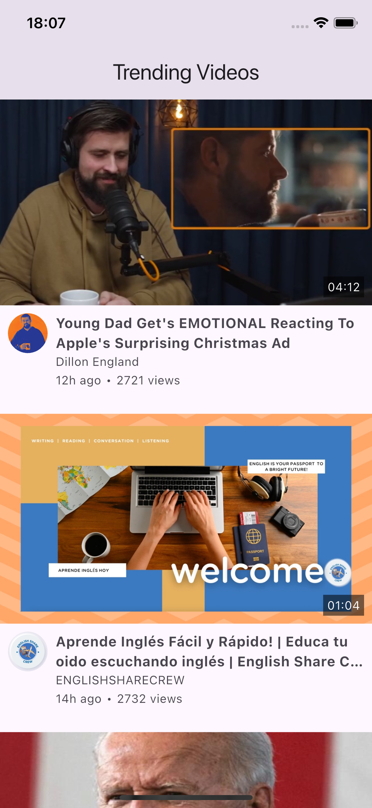
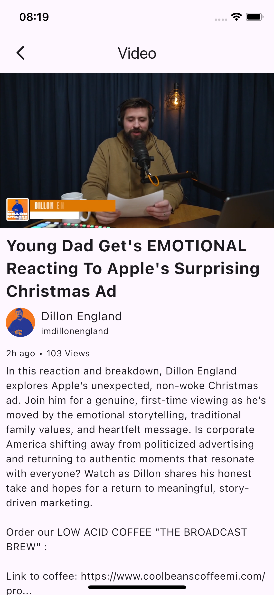

# Play TV

A Flutter application for streaming video content using Parler API and Bitmovin Player .

## Screenshots

<div style="display: flex; gap: 10px;">
    
    
</div>

### Prerequisites

- Flutter SDK (latest stable version)
- Bitmovin account with valid licenses
- iOS 14.0+

### Environment Setup

1. Create a `.env` file in the root directory:

```env
BITMOVIN_PLAYER_LICENSE_KEY=your_player_license_key
BITMOVIN_ANALYTICS_LICENSE_KEY=your_analytics_license_key
```

### Installation

1. Clone the repository:
```bash
git clone https://github.com/martwozniak/play_tv.git
cd play_tv
```

2. Install dependencies:
```bash
flutter pub get
```

3. Generate required files:
```bash
flutter pub run build_runner build --delete-conflicting-outputs
```

## Development

### Code Generation

After making changes to model classes, run:
```bash
flutter pub run build_runner build --delete-conflicting-outputs
```